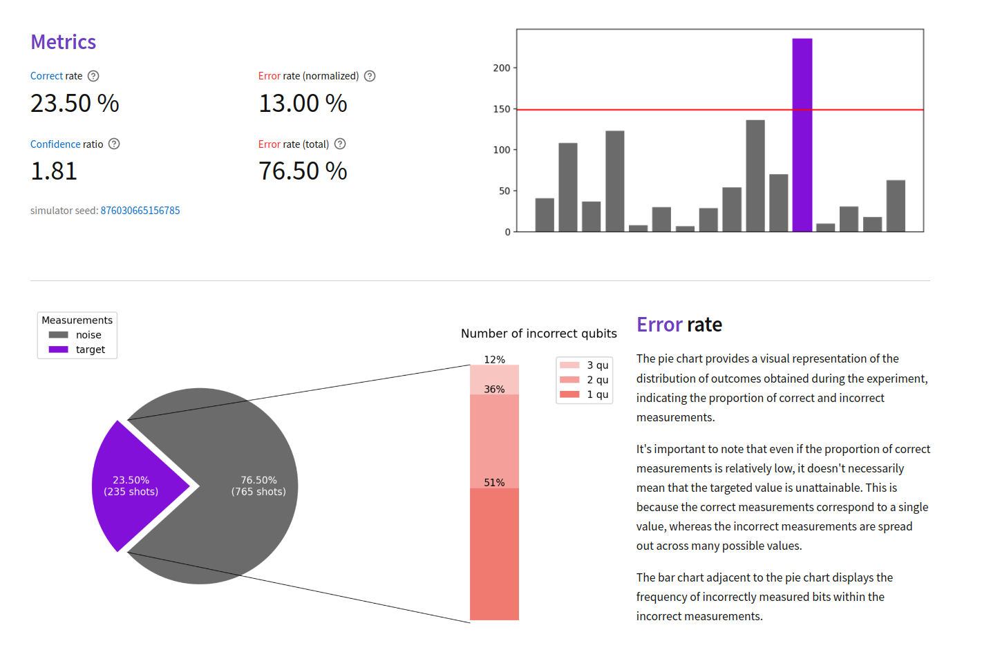
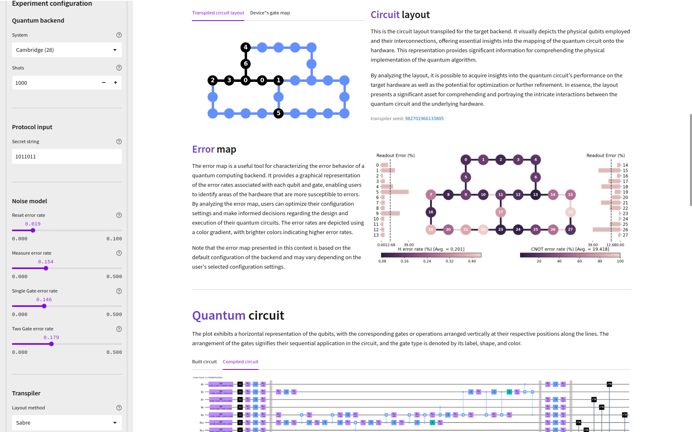

> bipyt semestral version

---

# bvviz - The Simulation and Visualization of the Bernstein-Vazirani Quantum Protocol

[](https://github.com/chutommy/bvviz/blob/main/LICENSE)

**bvviz** is a web app providing a user-friendly playground for running noisy quantum simulations
and visualizing the Bernstein-Vazirani quantum algorithm!



## Installation

To install **bvviz**, first download the source code to your local machine.

```bash
git clone https://github.com/chutommy/bvviz.git
cd chutommy/
```

Use the open-source package manager [conda](https://www.anaconda.com/) to install all dependencies.

```bash
conda env create -f environment.yml -n bvviz
```

## Usage

Run `make` command to start the `bvviz` server.

```bash
make run
```

Now open browser and go to [localhost:8080](http://localhost:8080/).

### Custom configurations

In the configuration, you are free to customize the device of the simulation as you want. However,
I recommend secret strings of size 4-12. If you want to experiment with bigger secret strings,
I advise not going over 16 since the computational demand of each experiment grows exponentially.

*Please avoid using the Prague backend. It will be fixed soon (probably), but it's corrupted right now. Thank you.*



## Tests

To test that all parts of the code are working properly, run the respective `make` command.

```bash
make test-unit
```

To run UI tests, make sure the server is online (on port 8080). The testing suit will create a new
session for testing purposes, so you don't need to worry about your current experiment.

Shortly after starting the test, a new testing browser will be opened. Please don't intervene
the testing while it's running (ideally, sit back and don't interact with the interface at all).

```bash
# skip if the server is already running
make run

# open a new terminal
make test-ui
```

> The app is made using the [Streamlit](https://streamlit.io/) library which currently does not support
> generating unique HTML id's nor classes. This means the UI testing is done by selecting
> by-products of the HTML generated content. This workaround isn't reliable, however, right now
> there are no other relevant ways of testing the UI. These issues are actively being discussed
> on multiple GitHub issue pages:
>
> 1. https://github.com/streamlit/streamlit/issues/3888
> 2. https://github.com/streamlit/streamlit/issues/5437
> 3. https://github.com/streamlit/streamlit/issues/6482
>
> Proper UI testing will be implemented once Streamlit delivers a way to uniquely identify HTML
> elements.