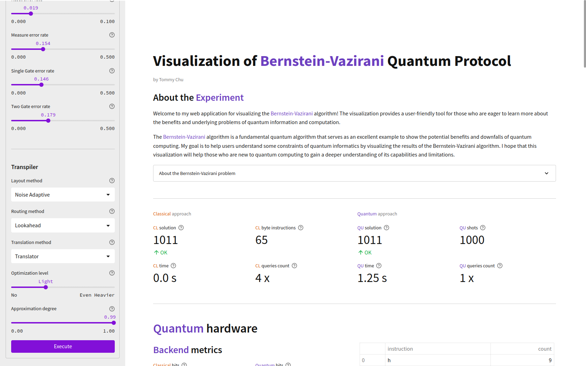
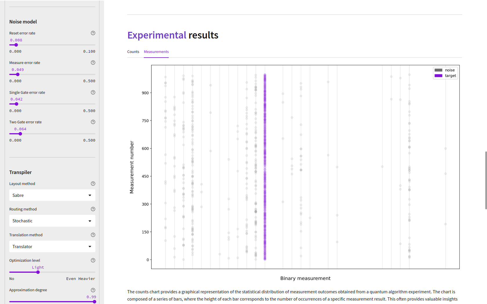

> bipyt semestral version

---

# Visualization of Bernstein-Vazirani Quantum Protocol (bvviz)

[](https://opensource.org/licenses/MIT)

**bvviz** is a web app providing a user-friendly playground for running noisy quantum simulations
and visualizing the Bernstein-Vazirani quantum algorithm!


## Installation

To install **bvviz**, first download the source code to your local machine and make sure
to check out to a correct branch `semestral`.

```bash
git clone git@gitlab.fit.cvut.cz:BI-PYT/B222/chutommy.git
cd chutommy/

git checkout semestral
```

Use the open-source package manager [conda](https://www.anaconda.com/) to install all requirements
and dependencies from an `environment.yml` file. Please be patient, this may take a while
depending on the machine you are using.

```bash
conda env create -f environment.yml -n bvviz
```

## Usage

To start the `bvviz` server, everything you need to do is to run a single `make` command.

```bash
make run
```

Now feel free to launch to your favorite browser of choice and go to
[localhost:8080](http://localhost:8080/).

### The layout



The layout is very intuitive. First thing of, let's ignore the configuration on the left hand side
for a moment and focus on the main page.

By default, the moment you open a new session there's a default experiment. Don't worry! You will
be able to run your own experiments later on. At the top of the web page there's a short
introduction to the **bvviz** project. You can expand the 'About' section to get to understand
the Bernstein Vazirani problem, however it's not import in order to enjoy the visualizations.

Below the introduction the fun begins. All the metrics, plots, charts and stats are thoroughly
described. If there happens to be something that's hard to grasp or not explained well enough,
please let me know.



If the statistics and visualizations are inadequate for you, at the bottom of the page there
are multiple options to download the result of the experiment:

1. **OpenQASM** is the quantum circuit of the experiment.
2. **Counts** is the number of measurements for each value.
3. **Measurements** contains the individual measurements in the preserved order.

### Custom configurations

Here's where the fun begins! Finally, let's take a look at the configuration sidebar.

In the configuration you are free to customize the conntext of the simulation, including the
backend quantum system the experiment will run on, number of shots to be taken, your own
secret string of the Bernstein-Vazirani problem, and your own noise and transpiler model!

Notice the quantum systems are named after cities! Yes, these are IBM's quantum providers. You
are (almost) free to choose any backend you want. Just remember that the secret string must be
compatible with the backend you choose.

I recommend secret string of size 5-8. If you want to experiment with higher number of experiments
I advise to not go over 15 since the computational demand of each experiment grows exponentially
fast with the rising number of simulating qubits. Simulating a Bernstein-Vazirani protocol with
a secret of size 14 already takes up to few minutes. Rather than waiting for the experiments to
finish play with different backends, noise model and transpiling methods. Notice how device maps
and circuit layouts changes based on the quantum system you choose.

*Please avoid using Prague backend. It's the only IBM's broken 'fake' backend right now. Thank you.*


## Tests

To test that all parts of the code is working properly, run the respective make command.

```bash
make test-unit
```

To run UI test, make sure the server is online and running on the port 8080.
If the server is already online, just skip the `make run` command. The testing suit
will create a new session for testing purpose.

The UI test will open a new browser to perform some testing experiments. Please don't intervene
the testing while ist's running (ideally sit back and don't interact with the interface at all).

```bash
# skip if server is already running
make run

# open a new terminal
make test-ui
```

The app is made using [streamlit](https://streamlit.io/) library which currently does not support
generating unique HTML id's nor classes. This means the UI testing is made by selecting by product's
of the HTML generated content. This workoutaround isn't realiable however there's no other relevant
ways of testing the UI. These issues were/are actively being discussed on multiple GitHub issue
pages:

1. https://github.com/streamlit/streamlit/issues/3888
2. https://github.com/streamlit/streamlit/issues/5437
3. https://github.com/streamlit/streamlit/issues/6482

Proper UI testing will be implemented once streamlit delivers a way to unique identify HTML
elements.