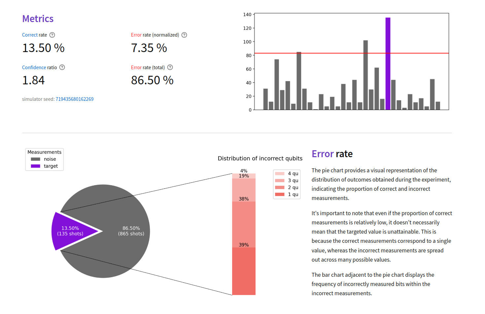
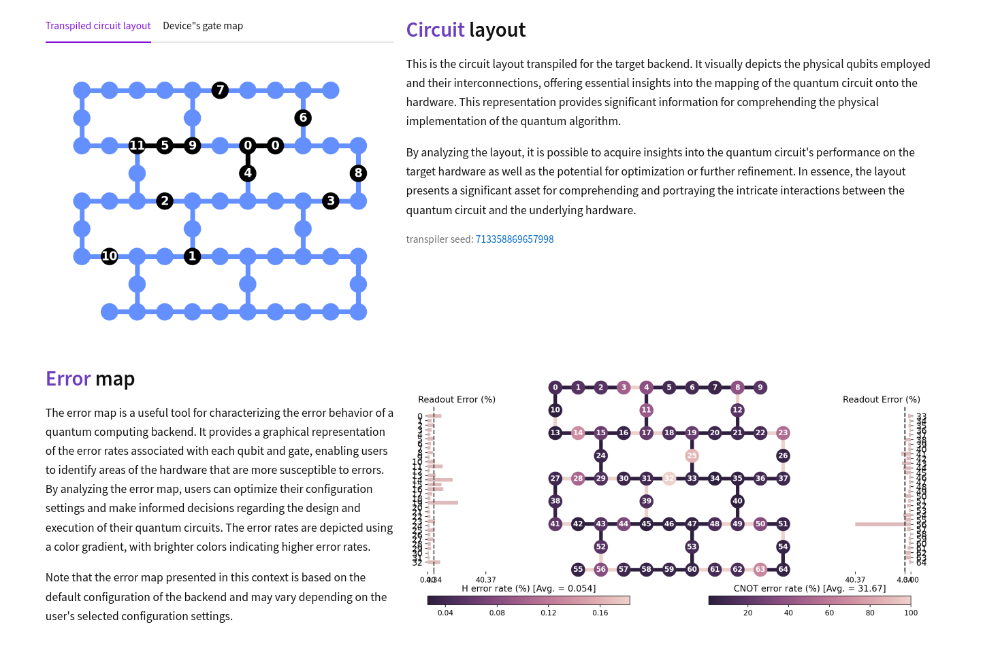

# bvviz - The Simulation and Visualization of the Bernstein-Vazirani Quantum Protocol

[](https://github.com/chutommy/bvviz/blob/main/LICENSE)

**bvviz** is a web app providing a user-friendly playground for running noisy quantum simulations
and visualizing the Bernstein-Vazirani quantum algorithm!



## Installation

To install **bvviz**, first download the source code to your local machine.

```bash
git clone https://github.com/chutommy/bvviz.git
cd bvviz/
```

Use the open-source package manager [conda](https://www.anaconda.com/) to install all dependencies to
a new environment named `bvviz`. Please be patient, this may take a while.

```bash
conda env create -f condaenv/environment.yml -n bvviz -q
```

## Usage

To perform simulations, activate the bvviz environment and initiate the server.

```bash
conda activate bvviz
make run
```

Now, launch a web browser and navigate to localhost:8501.

### Custom configurations

In the configuration, you are free to customize the device of the simulation as you want. However,
for best results I recommend secret strings with a length of 4-12. If you wish to experiment with larger secret strings,
keep in mind that the computational demand grows exponentially with increasing size. I suggest not exceeding a secret
string length of 16.

*Please avoid using the 'Prague' and 'Sherbrooke'' backends as of this moment they aren't working
propely (https://github.com/Qiskit/qiskit-terra/issues/9935).
They will likely be fixed soon, but for now, it's best to choose a different backend. Thank you.*



## Tests

To test that all parts of the code are working properly, run the respective `make` command.

```bash
make test-unit
```

To run UI tests, make sure the server is online (on port 8501). The testing suite will create a new
session for testing purposes, so you don't need to worry about your current experiment.

Shortly after starting the test, a new testing browser will be opened. Please don't intervene
the testing while it's running (ideally, don't interact with the interface at all).

```bash
# skip if the server is already running
make run

# run in a new terminal
make test-ui
```

> The app is made using the [Streamlit](https://streamlit.io/) library which currently does not support
> generating unique HTML id's nor classes. This means the UI testing is done by selecting
> by-products of the HTML generated content.
>
> This workaround isn't reliable, however, right now
> there are no other relevant ways of testing the UI. These issues are actively being discussed
> on multiple GitHub issue pages:
>
> 1. https://github.com/streamlit/streamlit/issues/3888
> 2. https://github.com/streamlit/streamlit/issues/5437
> 3. https://github.com/streamlit/streamlit/issues/6482
>
> Proper UI testing will be implemented once Streamlit delivers a way to uniquely identify HTML
> elements.
